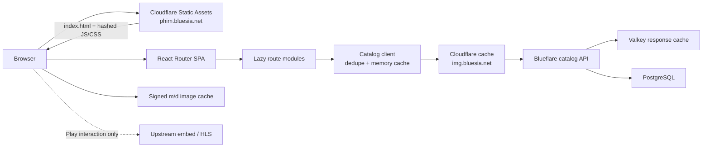
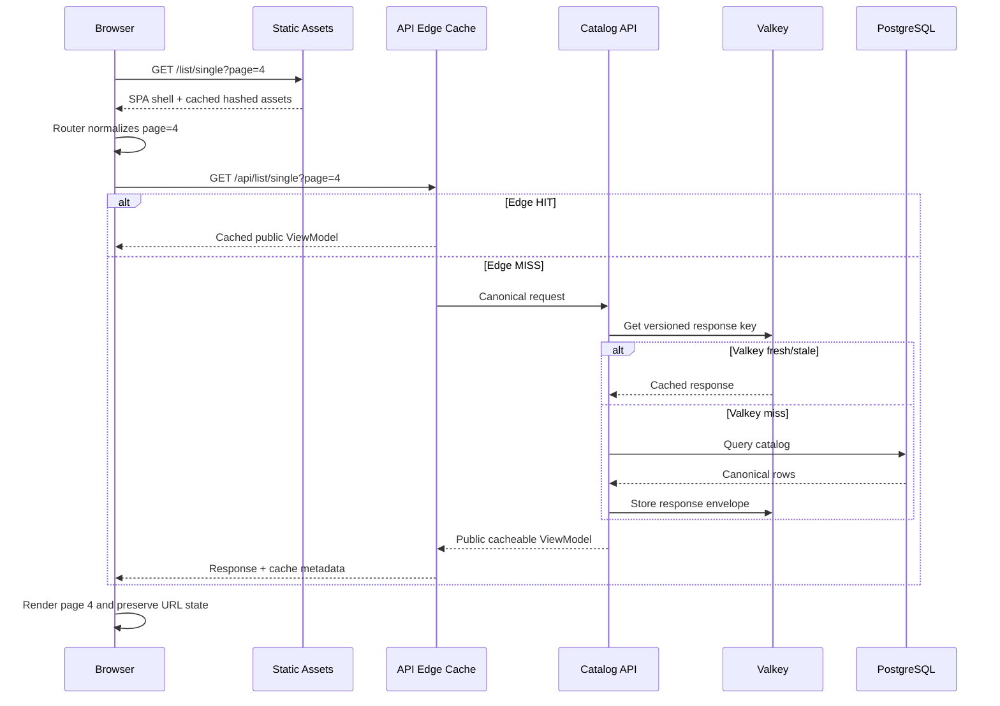

# Blueflare Frontend System Design — Superseded

> **ARCHIVED — phương án bị loại.** Đây là thiết kế static-SPA đã bị thay bằng
> SSR trên VPS. Giữ lại để tra cứu lý do loại. Nguồn sự thật: `CLAUDE.md`.

> **Superseded on 2026-08-15:** The deployment constraint changed from a static frontend to VPS server rendering. Use [`frontend-nextjs-vps-migration-plan.md`](./frontend-nextjs-vps-migration-plan.md) as the current proposal. This document is retained only as the rejected static-SPA alternative.

**Status:** Proposed
**Date:** 2026-08-15
**Decision owner:** Blueflare
**Scope:** Replace the Astro frontend; keep the existing Blueflare catalog API, PostgreSQL, Valkey, signed image service, and playback contracts.

## 1. Executive decision

Use **React 19 + Vite + React Router 7 Data Mode** as a fully static single-page application deployed with Cloudflare Static Assets.

Do **not** choose Next.js for the current Blueflare requirements. Next.js is technically possible, but neither of its deployment modes fits as cleanly:

- `output: "export"` removes the server features that distinguish Next.js and does not naturally support an unbounded `/movie/:slug` catalog at build time.
- SSR/ISR adds a runtime, cache invalidation paths, and operational complexity that conflict with the goals of a small frontend and predictable 95–99% cache reuse.

Next.js should be reconsidered only if request-time, per-movie HTML becomes a hard requirement for search indexing, social previews, or server-side personalization.

### Recommended stack

| Layer | Choice | Reason |
|---|---|---|
| UI | React 19 | Reuses the existing islands, player, cards, and state logic |
| Build | Vite | Small static output, hashed assets, dynamic imports, CSS splitting |
| Routing | React Router 7 Data Mode | Browser-only routing, unbounded slugs, route loaders, lazy route modules, full control without a server runtime |
| Styling | Tailwind CSS 4 + existing design tokens | Preserves the current cinematic shell and minimizes migration risk |
| Hosting | Cloudflare Static Assets | Automatic edge delivery and SPA fallback, with no frontend Worker code |
| Catalog data | Existing `img.bluesia.net/api/*` | Keeps the VPS API, PostgreSQL provenance, Valkey cache, and signed images unchanged initially |
| Client state | Existing lightweight catalog cache + `localStorage` | Avoids adding a state/query dependency before it is justified |
| Playback | Existing centralized playback policy | Embed first on desktop/Android; native HLS first on iOS; dynamic `hls.light.js` fallback only |

## 2. Goals and non-goals

### Goals

- Match a Netflix-class interaction model: persistent navigation, instant client transitions, skeleton states, horizontal rails, preserved scroll context, and deferred player loading.
- Eliminate static-generation constraints for `/movie/:slug`, pagination, filters, searches, and future catalog routes.
- Keep the frontend deployable as immutable static assets with no Node, SSR, or frontend Worker runtime.
- Achieve **95–99% edge HIT on eligible, repeated traffic**, measured separately for static assets, images, and public catalog API responses.
- Preserve the existing API, image-cache, navigation-context, and playback contracts.
- Make pagination and URL state canonical so page 2, 3, 4, 5, filters, and back/forward navigation are deterministic.

### Non-goals

- Proxying, transcoding, re-chunking, or caching HLS/video streams.
- Introducing a third image variant or changing the shared signed-image key.
- Moving catalog data into the frontend or Cloudflare KV.
- Personalizing shared HTML/API responses at the CDN edge.
- Rewriting the VPS backend as part of the frontend migration.

## 3. Decision matrix

Scores are relative to Blueflare's current constraints; 5 is best.

| Option | Static simplicity | Dynamic catalog routes | Cache determinism | Reuse current React | SEO per movie | Operational weight | Result |
|---|---:|---:|---:|---:|---:|---:|---|
| React + Vite + React Router Data Mode | 5 | 5 | 5 | 5 | 2 | 5 | **Recommended** |
| React Router Framework SPA Mode | 4 | 5 | 5 | 5 | 2 | 4 | Good alternative, but adds build-time SSR constraints |
| Next.js static export | 3 | 2 | 5 | 5 | 3 | 3 | Technically possible, poor fit for unbounded movie slugs |
| Next.js SSR/ISR | 2 | 5 | 2 | 5 | 5 | 2 | Use only if request-time HTML becomes mandatory |
| Svelte/Solid SPA | 5 | 5 | 5 | 1 | 2 | 3 | Smaller runtime, but forces an unnecessary UI/player rewrite |

Next.js static export produces hostable static files, but its official documentation lists rewrites, headers, ISR, default image optimization, and runtime dynamic routes among unsupported or constrained features. React Router Data Mode keeps Blueflare browser-only while allowing route loaders and lazy route modules without Framework Mode's build-time server-render requirement. See [Next.js static exports](https://nextjs.org/docs/pages/guides/static-exports), [Next.js SPA guidance](https://nextjs.org/docs/app/guides/single-page-applications), [React Router modes](https://reactrouter.com/start/modes), and [React Router code splitting](https://reactrouter.com/explanation/code-splitting).

## 4. Target architecture



### Frontend route map

| Route | Module | Data source | Cache behavior |
|---|---|---|---|
| `/` | Home | `/api/home` | Shared, hot, prefetch-safe |
| `/list/:type?page=N` | Category list | `/api/list/:type?page=N` | Shared by type and page |
| `/genre/:slug?page=N` | Genre list | `/api/genre/:slug?page=N` | Shared by slug and page |
| `/country/:slug?page=N` | Country list | `/api/country/:slug?page=N` | Shared by slug and page |
| `/search?q=…&page=N` | Search | `/api/search` | Short TTL; no speculative prefetch |
| `/movie/:slug?returnTo=…` | Detail and playback | `/api/movie/:slug` | Shared movie metadata; player stays client-only |
| `/favorites` | Favorites | `localStorage` | Private browser state |
| `/history` | History | `localStorage` | Private browser state |
| `/settings` | Settings | Static/browser state | No catalog fetch required |

Cloudflare should serve the same SPA shell for unknown application paths:

```jsonc
{
  "assets": {
    "directory": "./dist",
    "html_handling": "drop-trailing-slash",
    "not_found_handling": "single-page-application"
  }
}
```

This is a Static Assets setting, not a frontend Worker implementation. Cloudflare documents SPA fallback and automatic asset caching in [React SPA deployment](https://developers.cloudflare.com/workers/framework-guides/web-apps/react/) and [Static Assets](https://developers.cloudflare.com/workers/static-assets/).

## 5. Navigation and pagination contract

The current pagination symptom—clicking page 2/3/4/5 and returning to page 1—is primarily a URL/state ownership problem. The new frontend must make the URL the source of truth.

### Canonical rules

1. The current page is read from `URLSearchParams`; invalid, missing, negative, decimal, or non-numeric values normalize to page 1.
2. Pagination links are real anchors with canonical `href` values. JavaScript may enhance them, but must not be required for correctness.
3. A route loader receives the normalized page and uses that exact value in the API request and cache key.
4. Filter or category changes reset `page` to 1; a page click preserves category/filter/search state.
5. Back/forward navigation reconstructs state from the URL and restores the saved vertical and horizontal scroll positions.
6. Movie links use `/movie/:slug?returnTo=<encoded path+search>`. New links never use hash fragments for category context.
7. The strict Netflix-style compact pagination window remains defined by `docs/PAGINATION.md` and should have unit tests for boundaries, ellipses, and last-page behavior.
8. Only canonical query parameters are sent to catalog endpoints. UI-only values such as `returnTo`, tracking parameters, and playback state never enter API cache keys.

### Required route-level tests

- Direct load of page 2, 3, 4, 5 and the last page.
- Previous/next at both boundaries.
- Switching between film types while on a page greater than 1.
- Browser back/forward after category → movie → return navigation.
- Encoded search terms, Unicode, empty terms, duplicated query parameters, and malformed pages.
- Reloading a movie detail route directly through Cloudflare SPA fallback.

## 6. Netflix-class UI performance model

The visual quality target is driven more by interaction architecture than by framework choice.

### Application shell

- Keep `GlobalNav` mounted across route transitions; only route content changes.
- Render immediate route skeletons using the exact card and hero aspect ratios to avoid layout shift.
- Preserve page scroll and per-rail horizontal scroll keyed by canonical URL.
- Use pending navigation state for subtle progress feedback; never blank the existing screen during a transition.
- Use CSS scroll snapping and native overflow for rails; virtualize only genuinely long grids or episode lists.

### Loading and bundles

- Split every top-level route with `route.lazy()`.
- Put the player, episode selector, and HLS fallback in a separate detail-route chunk.
- Keep `hls.js/dist/hls.light.js` behind a dynamic import that runs only after source selection requires MSE.
- Mount embed iframes only after an explicit Play action; revealing the player must not autoplay.
- Prefetch only predictable, inexpensive routes on hover/focus or idle, and skip prefetch under `Save-Data` or slow effective connections.
- Avoid a global query/state library in phase 1. Add one only when measured duplication, invalidation, or mutation needs exceed the existing catalog client.

### Images

- Keep the first visible home hero as the only eager, high-priority image.
- Lazy-load other posters/backdrops with stable dimensions and async decoding.
- Continue consuming only the pre-signed `m` and `d` variants supplied by the API.
- Do not add a Next/Image-style transformation layer; it would duplicate the existing image cache and reduce shared-key reuse.

Vite fingerprints imported production assets and supports dynamic-import and CSS code splitting; see [Vite static assets](https://vite.dev/guide/assets.html) and [Vite production builds](https://vite.dev/guide/build).

## 7. Cache architecture

### What “95–99% HIT” means

The target is realistic for **eligible repeated traffic**, not for every request combined. First requests, long-tail search terms, health checks, external embeds, and video segments cannot be expected to hit at that rate.

Track these classes independently:

| Traffic class | Target | Notes |
|---|---:|---|
| Hashed JS/CSS/fonts | 99%+ | Immutable URLs; deploy creates new hashes |
| Signed image objects | 97–99% | Content-addressed shared keys; long TTL; Tiered Cache |
| Home/list/genre/country API | 95–99% on hot routes | Canonical query keys and stale serving |
| Movie API | 90–98% | Long-tail titles lower the aggregate |
| Search API | No global 95% promise | Highly variable query cardinality; short TTL or edge bypass |
| HLS/embed/video | Excluded | Must remain direct to upstream media providers |

Strict reporting should use `HIT / eligible requests`. Also report an “origin offload” metric that includes valid revalidation/stale responses, because it measures VPS protection better than the HIT label alone.

### Proposed cache policy

| Resource | Browser policy | Edge TTL | Stale window | Invalidation |
|---|---|---:|---:|---|
| Hashed JS/CSS/fonts | `max-age=31536000, immutable` | 1 year | None needed | New filename on deploy |
| SPA `index.html` | 0–60 seconds | 5–15 minutes | Up to 24 hours | Purge exact URL on deploy |
| Home/list/genre/country | 30–60 seconds | 5 minutes | Up to 24 hours | Target affected URLs after sync |
| Movie detail | 30–60 seconds | 15–60 minutes | Up to 24 hours | Purge the changed slug |
| Taxonomies | 5 minutes | 24 hours | Up to 7 days | Purge after taxonomy sync |
| Search | `no-store` or ≤30 seconds | 0–60 seconds | Optional | Expiry only |
| Signed `m`/`d` images | Long-lived immutable | 30 days–1 year | Optional | Content-addressed URL replacement |
| Health/private responses | `no-store` | Bypass | None | Not applicable |

Set edge TTLs through Cloudflare Cache Rules so browser freshness and edge freshness are independent. Do not rely on the current combination of `s-maxage` and `stale-while-revalidate` without validation: Cloudflare's Origin Cache Control behavior can treat `s-maxage` as requiring proxy revalidation and prevent stale serving. See [Cloudflare cache revalidation](https://developers.cloudflare.com/cache/concepts/revalidation/).

### Cache-key rules

Use one canonical key per public representation:

- Home: pathname only.
- List: normalized `type` + positive integer `page`.
- Genre/country: normalized slug + positive integer `page`.
- Movie: normalized canonical slug.
- Search: normalized Unicode, collapsed whitespace, lowercase keyword + page.
- Images: existing `sha256(upstreamUrl) + variant`; never include requester domain, frontend route, or UI parameters.

Never vary public catalog responses by cookie, authorization, user agent, device, referrer, `returnTo`, analytics parameters, or query ordering. Cloudflare notes that unnecessary cache-key variation reduces hit rate; see [Cache keys](https://developers.cloudflare.com/cache/how-to/cache-keys/).

### Current risks to fix after frontend migration

1. **Dynamic CORS variation:** Public GET responses currently vary by request origin. For a genuinely public catalog API, prefer `Access-Control-Allow-Origin: *` and remove `Vary: Origin`, or prove with Cache Analytics that Origin is not entering the effective edge key. Never use wildcard CORS for credentialed/private endpoints.
2. **Global cache-version invalidation:** Bumping one catalog version can cold-start all Valkey entries. Prefer resource-scoped invalidation: changed movie slug, affected list pages, home, and taxonomy only when necessary.
3. **Stale stampede:** Multiple stale requests may rebuild the same key concurrently. Add a short Valkey single-flight lock (`SET ... NX EX`): one request refreshes while others receive stale data.
4. **Query fragmentation:** Normalize pages, slugs, Unicode search text, whitespace, and query ordering before both edge and Valkey key generation.
5. **Negative traffic:** Cache safe movie 404 results briefly (30–60 seconds) to absorb repeated bad slugs and bot traffic.
6. **Cross-POP misses:** Enable Tiered Cache so regional edge misses can reuse an upper-tier object before reaching the VPS. Consider Cache Reserve for high-value image objects only after checking cost and analytics. See [Tiered Cache](https://developers.cloudflare.com/cache/how-to/tiered-cache/) and [Cache Reserve](https://developers.cloudflare.com/cache/advanced-configuration/cache-reserve/).

## 8. Data flow



## 9. Observability and acceptance criteria

### Cache telemetry

- Record `CF-Cache-Status`, `Age`, route class, normalized cache key class, response size, and origin latency.
- Preserve the backend's `x-blueflare-cache` signal to distinguish Cloudflare HIT/MISS from Valkey fresh/stale/miss.
- Use Cloudflare Cache Analytics/Logpush for 1-hour, 24-hour, and 7-day views.
- Alert on unexpected `BYPASS`, falling `Age`, query-cardinality spikes, or origin request growth after a deploy.

Cloudflare recommends verifying the same URL with repeated requests: a healthy edge path moves from `MISS` to `HIT`, and `Age` increases on subsequent hits. See [cache response statuses](https://developers.cloudflare.com/cache/concepts/cache-responses/) and [cache troubleshooting](https://developers.cloudflare.com/cache/troubleshooting/investigating-uncached-responses/).

### Release gates

- Static output contains no frontend server bundle or `_worker.js` application runtime.
- Direct navigation and refresh work for every route, including arbitrary `/movie/:slug` paths.
- Pagination tests pass for pages 1, 2, 3, 4, 5, the last page, malformed pages, and browser back/forward.
- Existing navigation-context and bottom-nav rules pass with `returnTo`.
- Desktop/Android embed priority, iOS native HLS priority, deferred iframe, and dynamic light HLS fallback remain intact.
- Lighthouse mobile targets on representative production-like data: LCP ≤2.5 s, CLS ≤0.1, INP ≤200 ms at the 75th percentile.
- Two identical cache-eligible requests through the same edge location show first `MISS`/`EXPIRED`, then `HIT` with increasing `Age`.
- Seven-day eligible HIT targets are reported separately; static assets and images must not be averaged with search/video to hide regressions.
- Origin requests per thousand eligible page views decline or remain flat after migration.

## 10. Migration plan

### Phase 0 — Freeze contracts and baseline

- Inventory current routes, query parameters, redirects, localStorage keys, API ViewModels, image URL contract, and playback behavior.
- Capture current bundle sizes, Web Vitals, Cloudflare cache status distribution, Valkey hit/stale/miss ratio, and origin requests per page view.
- Add navigation and pagination behavior tests before changing routing.

**Exit:** A reproducible baseline and test matrix exist.

### Phase 1 — Create the static SPA shell

- Replace Astro build entry points with Vite, React, and React Router Data Mode.
- Port global styles, design tokens, `BaseLayout`, `GlobalNav`, footer, and persistent mobile navigation.
- Configure Cloudflare Static Assets SPA fallback.
- Keep the existing API hostname and environment contract.

**Exit:** Home, 404, direct refresh, and deployment work with no frontend runtime server.

### Phase 2 — Port catalog routes

- Port home, list, genre, country, search, movie, favorites, history, and settings as lazy route modules.
- Reuse current React components and `lib/catalog.ts`; remove Astro-only wrappers and hydration directives.
- Make URL parsing/serialization a single shared navigation module.

**Exit:** Route parity exists, including arbitrary movie slugs and canonical links.

### Phase 3 — Correct navigation and pagination

- Implement loader-owned canonical page parsing.
- Use real anchor URLs for all tabs, pagination items, cards, and contextual return navigation.
- Preserve scroll state and test browser history behavior.
- Implement the compact pagination algorithm exactly as documented.

**Exit:** The known page 2/3/4/5 regression and the complete route test matrix pass.

### Phase 4 — Restore Netflix-class interaction quality

- Add route skeletons, persistent shell transitions, route/rail scroll restoration, adaptive prefetch, and detail/player chunk boundaries.
- Validate image priority, layout stability, focus states, reduced motion, keyboard rail navigation, and mobile gestures.
- Run desktop/mobile visual comparison against existing design references.

**Exit:** No functional or visual regression; Core Web Vitals meet the release gates.

### Phase 5 — Harden cache behavior

- Apply canonical edge cache keys and per-resource Edge TTL rules.
- Resolve public CORS variation, add resource-scoped invalidation, Valkey single-flight refresh, and short negative caching.
- Enable Tiered Cache; evaluate Cache Reserve for images from real traffic economics.
- Add dashboards for edge status, Valkey state, origin latency, and request volume.

**Exit:** Repeated requests demonstrate edge HIT behavior and seven-day metrics meet class-specific targets.

### Phase 6 — Canary and cutover

- Deploy a preview/canary hostname against the production catalog API.
- Run route, accessibility, playback, visual, caching, and slow-network QA.
- Shift traffic gradually with an immediate static rollback artifact available.
- Remove Astro dependencies and legacy rewrites only after the canary is stable.

**Exit:** Production traffic is stable, cache/origin metrics are healthy, and the previous static artifact remains recoverable for the agreed rollback window.

## 11. Risks and mitigations

| Risk | Impact | Mitigation |
|---|---|---|
| SPA metadata is generic for movie pages | Lower per-title SEO/social preview quality | Keep a generic shell now; reconsider SSR/edge-generated metadata only when business evidence justifies it |
| A bad deploy can strand cached HTML referencing removed assets | Broken app shell | Keep hashed assets available across releases, purge `index.html` exactly, and retain rollback artifacts |
| Aggressive API TTL serves outdated episode metadata | Playback/catalog lag | Targeted movie purge after sync and bounded stale windows |
| Search cardinality destroys cache efficiency | Low HIT and large cache footprint | Short TTL or bypass at edge; retain Valkey normalization and protection |
| Route prefetch competes with hero/media requests | Worse LCP/data use | Prefetch only on intent/idle and honor `Save-Data`/network quality |
| Migration changes playback behavior | User-visible regression | Port playback module unchanged first; verify device/source matrix before refactoring |

## 12. Architecture decision record

### ADR-001 — Static React SPA with Vite and React Router Data Mode

**Decision:** Replace Astro with a static React SPA built by Vite and routed by React Router Data Mode.

**Why:** It preserves the current React investment, supports arbitrary catalog routes at runtime, keeps all frontend output CDN-cacheable, and avoids carrying an SSR/ISR runtime that Blueflare does not currently need.

**Consequences:**

- Positive: smallest migration surface, deterministic static deployment, simple rollback, strong asset cacheability, and correct runtime routing for arbitrary movie slugs.
- Negative: movie pages do not receive request-time, title-specific HTML metadata; initial content depends on client API fetches.
- Revisit trigger: measurable organic/social acquisition requires per-movie HTML, or server-side personalization becomes a funded product requirement.

## 13. Immediate implementation backlog

1. Approve ADR-001 and confirm that generic SPA metadata is acceptable.
2. Add tests that reproduce the current pagination and navigation bugs.
3. Scaffold the Vite/React Router shell without deleting the working Astro implementation.
4. Port routes incrementally and keep backend/API contracts unchanged.
5. Run a production-like canary and collect cache/Web Vital baselines.
6. Apply cache-key, CORS, stale-refresh, and invalidation hardening only after route parity.
