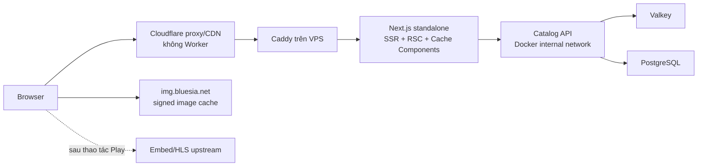

# Kế hoạch chuyển Blueflare sang Next.js render trên VPS

**Trạng thái:** Đề xuất để duyệt
**Ngày:** 2026-08-15
**Phạm vi:** Thay Astro bằng frontend SSR mới; giữ catalog API, PostgreSQL, Valkey, image cache và playback contract hiện tại.
**Ràng buộc:** Frontend render trên VPS; không dùng Cloudflare Worker, Pages Functions hay edge runtime.

## 1. Giả định cần khóa khi duyệt

“Render trên VPS” được hiểu là **HTML/RSC được render bởi Node.js trên VPS**, không chỉ build và serve file tĩnh. Theo cách hiểu này, lựa chọn phù hợp nhất là Next.js App Router self-hosted.

Nếu ý định thực tế chỉ là đặt file JS/HTML tĩnh trên VPS và render trong trình duyệt, React + Vite vẫn nhẹ hơn. Kế hoạch bên dưới chủ động chọn SSR vì nó đáp ứng trực tiếp yêu cầu render trên VPS, metadata theo từng phim và direct-load `/movie/:slug`.

## 2. Quyết định kiến trúc đề xuất

Chọn **Next.js 16 App Router + React 19**, chạy bằng Node.js LTS trong Docker, đặt sau Caddy hiện có.



Next.js chính thức hỗ trợ self-host bằng Node/Docker và khuyến nghị đặt reverse proxy như nginx/Caddy phía trước server. `output: "standalone"` tạo runtime tối thiểu phù hợp cho container. Tham khảo [Next.js self-hosting](https://nextjs.org/docs/app/guides/self-hosting) và [Next.js deployment adapters/self-hosting](https://nextjs.org/blog/nextjs-across-platforms).

### Vì sao đổi quyết định từ Vite SPA sang Next.js

- VPS chịu trách nhiệm render HTML thật sự, thay vì chỉ phân phối app shell.
- `/movie/:slug` có HTML, title, description, canonical và Open Graph theo từng phim ngay lần tải đầu.
- Server Components giảm lượng JavaScript gửi xuống trình duyệt; chỉ nav tương tác, slider, local actions và player cần client bundle.
- Cache Components của Next.js 16 cho phép cache theo hàm/component, TTL rõ ràng và invalidation theo tag.
- App Router hỗ trợ streaming/Suspense, loading skeleton và navigation mềm phù hợp trải nghiệm kiểu Netflix.
- Dùng lại gần như toàn bộ React component, Tailwind token, catalog types và playback logic hiện có.

### Những gì không dùng

- Không Cloudflare Worker, Pages Functions, edge middleware hoặc edge runtime.
- Không `output: "export"`.
- Không proxy/re-chunk video.
- Không Next.js image optimizer cho poster/backdrop đã được Blueflare ký và cache.
- Không Redux, Zustand, TanStack Query hoặc UI framework lớn trong giai đoạn migration.
- Không đổi API ViewModel hoặc database schema chỉ để phục vụ framework mới.

## 3. Bộ phiên bản stable latest

Các phiên bản dưới đây được xác minh ngày 2026-08-15. Khi bắt đầu implementation phải kiểm tra lại npm `latest`, cài bản stable mới nhất rồi khóa **exact patch** trong `package-lock.json`; không dùng canary, beta, RC hoặc range trôi tự do.

| Thành phần | Phiên bản chốt hiện tại | Chính sách |
|---|---:|---|
| Next.js | `16.3.1` | npm `latest`, App Router, Node runtime |
| React / React DOM | `19.2.8` | npm `latest`, gồm các bản vá RSC mới nhất |
| TypeScript | `7.0.2` | npm `latest`, strict mode |
| Tailwind CSS / PostCSS plugin | `4.3.3` | npm `latest`; khóa exact patch |
| Node.js | `24.18.0` LTS | Production dùng latest LTS, không dùng Node 26 Current |
| Package manager | npm đi kèm Node 24 | Dùng `npm ci`; lockfile là nguồn tái lập build |

Nguồn phiên bản: [Next.js npm latest](https://registry.npmjs.org/next/latest), [React npm latest](https://registry.npmjs.org/react/latest), [React releases](https://react.dev/versions), [TypeScript npm latest](https://registry.npmjs.org/typescript/latest), [Tailwind CSS npm latest](https://www.npmjs.com/package/tailwindcss?activeTab=versions), và [Node.js release status](https://nodejs.org/en/about/previous-releases).

Node 26 là bản Current vào thời điểm audit; production chọn Node 24 LTS vì “stable latest” cho runtime phải ưu tiên nhánh còn được bảo trì dài hạn.

## 4. Cấu trúc ứng dụng mục tiêu

```text
app/
├── layout.tsx
├── page.tsx
├── loading.tsx
├── not-found.tsx
├── list/[type]/page.tsx
├── search/page.tsx
├── movie/[slug]/page.tsx
├── favorites/page.tsx
├── history/page.tsx
├── settings/page.tsx
└── api/internal/revalidate/route.ts
components/
├── server/
├── client/
└── player/
lib/
├── catalog-server.ts
├── catalog-client.ts
├── cache-policy.ts
├── navigation.ts
├── playback.ts
└── types.ts
public/
tests/
├── unit/
└── e2e/
```

### Route mapping

| Hiện tại | Mục tiêu | Render | Ghi chú |
|---|---|---|---|
| `/` | `app/page.tsx` | Cached Server Component | Hero + rail data được fetch song song |
| `/list/[type]?page=N` | `app/list/[type]/page.tsx` | Cached Server Component | URL là nguồn sự thật cho page/filter |
| `/search?q=…&page=N` | `app/search/page.tsx` | Dynamic SSR | Cardinality cao; không edge-cache HTML |
| `/detail/` + rewrite | `/movie/[slug]` | Cached Server Component | Bỏ shell rewrite; metadata theo slug |
| `/favorites` | `app/favorites/page.tsx` | Static shell + Client Component | Dữ liệu vẫn ở `localStorage` |
| `/history` | `app/history/page.tsx` | Static shell + Client Component | Dữ liệu vẫn ở `localStorage` |
| `/settings` | `app/settings/page.tsx` | Static/cached | Giữ attribution bắt buộc |
| `/404` | `app/not-found.tsx` | Static | Đúng status 404 |

### Ranh giới Server/Client Component

**Server mặc định:** layout, metadata, hero shell, list/grid, movie metadata, episode metadata và mọi fetch catalog ban đầu.

**Chỉ thêm `"use client"` cho:** GlobalNav search/menu, HeroSlider, horizontal rail controls, Pagination enhancement, favorites/history actions, player facade, episode interaction và browser storage.

Không đánh dấu toàn bộ trang là Client Component. Dữ liệu truyền từ server xuống client phải là ViewModel nhỏ, serializable; không truyền lặp cả movie object vào nhiều client subtree.

## 5. Data-fetch và cache trong Next.js

### Luồng fetch

- Server Components gọi API qua Docker network: `http://api:3200/api/*`; không đi vòng qua DNS/Cloudflare.
- Browser chỉ gọi API public cho tác vụ thực sự client-only như search suggest; playback vẫn lấy URL đã được server chuẩn hóa.
- Các fetch độc lập của home chạy song song; không tạo waterfall theo từng rail.
- `generateMetadata()` và page dùng chung một cached `getMovie(slug)` để không fetch hai lần.
- Search động dùng AbortController/debounce ở client và không prefetch query ngẫu nhiên.

### Cache Components

Bật `cacheComponents: true`. Các data function công khai dùng `'use cache'`, `cacheLife()` và `cacheTag()` rõ ràng. Đây là API ổn định của Next.js 16 trên Node/Docker; không dùng edge runtime. Tham khảo [`use cache`](https://nextjs.org/docs/app/api-reference/directives/use-cache), [`cacheLife`](https://nextjs.org/docs/app/api-reference/functions/cacheLife), và [`cacheTag`](https://nextjs.org/docs/app/api-reference/functions/cacheTag).

| Nhóm dữ liệu | Next server cache | Tag đề xuất | API/Valkey hiện tại |
|---|---:|---|---:|
| Home | stale 5m, revalidate 5m, expire 24h | `home` | 5m + stale envelope |
| List type/page | stale 5m, revalidate 5m, expire 24h | `list:{type}`, `page:{N}` | 5m + stale |
| Movie detail | stale 15m, revalidate 15m, expire 24h | `movie:{slug}` | 5m + stale |
| Taxonomy | stale 1h, revalidate 24h, expire 7d | `taxonomy` | 1h |
| Search | Không cache render dài hạn | Không tag | Valkey 60s |
| Favorites/history | Không server-cache dữ liệu cá nhân | Không tag | Browser localStorage |

### Invalidation

- Sync worker sau khi cập nhật phim gọi endpoint nội bộ của Next để `revalidateTag('movie:{slug}')` và các list/home liên quan.
- Endpoint chỉ truy cập được trong Docker network hoặc bắt buộc HMAC secret + kiểm tra timestamp; Caddy không public route này.
- Không bump một global cache version cho mọi thay đổi nhỏ.
- Nếu callback revalidation thất bại, TTL vẫn tự hồi phục; worker retry có backoff và idempotency key.
- Giai đoạn đầu chạy một Next instance nên cache mặc định đủ để cutover. Chỉ thêm custom Valkey `cacheHandler` khi cần nhiều instance hoặc cần giữ Next render cache qua deploy; không đưa độ phức tạp này vào đường găng migration.

## 6. Cache Cloudflare không cần Worker

Cloudflare chỉ làm proxy/CDN bằng DNS orange-cloud và Cache Rules. Không deploy script nào.

### Nguyên tắc an toàn

- Cache HTML chỉ cho GET/HEAD công khai, không phụ thuộc cookie hoặc authorization.
- **Bypass toàn bộ RSC/Flight request** có `?_rsc`, header `RSC`, prefetch/router-state; các representation này phức tạp và không được trộn với full HTML.
- Bypass `/search`, `/api/*`, `/healthz`, request có authorization, preview hoặc session cookie.
- Favorites/history chỉ render shell chung; dữ liệu riêng tư đọc từ `localStorage` sau hydration.
- Không override cache HTML toàn hostname bằng một rule rộng.

### Cache policy đề xuất

| Tài nguyên | Cloudflare | Browser | Mục tiêu HIT |
|---|---:|---:|---:|
| `/_next/static/*` | 1 năm, immutable | 1 năm | ≥99% |
| Fonts/logo hash | 1 năm, immutable | 1 năm | ≥99% |
| Full HTML `/`, `/list/*`, `/movie/*`, settings shell | 5 phút + stale phù hợp | 0–60s | 95–99% trên route nóng |
| RSC `?_rsc=*` | Bypass | Next router cache | Không tính edge HIT |
| Search HTML | Bypass | `no-store` | Không đặt mục tiêu |
| `img.bluesia.net/i/m/*`, `/i/d/*` | 30 ngày–1 năm | dài hạn | 97–99% |
| Catalog API công khai | Rule hiện có, tối ưu tiếp | theo origin | 95–99% route nóng |
| HLS/embed/video | Bypass | upstream policy | Loại khỏi chỉ số |

Cloudflare Cache Rules có thể cache HTML bằng “Cache Everything”, nhưng tài liệu chính thức cảnh báo phải loại trừ nội dung động/cá nhân. Rule chỉ áp dụng cho tập route allowlist nêu trên. Tham khảo [Cloudflare Cache Rules](https://developers.cloudflare.com/cache/how-to/cache-rules/) và [Cache Everything](https://developers.cloudflare.com/cache/how-to/cache-rules/examples/cache-everything/).

### Định nghĩa 95–99%

Không dùng một tỷ lệ tổng hợp để che search, RSC và video. Báo cáo riêng:

1. Edge HIT static assets.
2. Edge HIT signed images.
3. Edge HIT full-document HTML đủ điều kiện.
4. Edge HIT catalog API đủ điều kiện.
5. Next render-cache HIT.
6. API Valkey `fresh/stale/miss`.
7. Origin requests trên 1.000 page views.

Với SSR Next.js, 95–99% **không hợp lý cho mọi request** vì soft navigation dùng RSC và search có cardinality cao. Mục tiêu đúng là 95–99% cho từng nhóm cache-eligible, đồng thời ≥95% origin offload khi cộng Next cache và Valkey.

## 7. Navigation và pagination contract

Lỗi page 2/3/4/5 phải được khóa bằng test trước khi port UI.

1. `searchParams` là nguồn sự thật; Server Component parse `page` một lần.
2. Missing/0/âm/thập phân/NaN normalize về page 1 và canonical redirect khi cần.
3. Pagination tạo `<Link href>` thật; không dùng handler tự tăng state mà quên URL/API key.
4. Loader/server fetch nhận đúng page đã normalize và tạo cache key chứa type/slug/page.
5. Đổi category/filter reset page về 1; bấm page giữ nguyên category/filter/search hợp lệ.
6. `/movie/[slug]?returnTo=<encoded pathname+search>` là contract duy nhất cho context mới; hash/from chỉ đọc để tương thích link cũ.
7. Back/forward phải phục hồi URL, vertical scroll và vị trí rail.
8. Thuật toán compact window giữ đúng `docs/PAGINATION.md`.
9. Prefetch link tắt hoặc giới hạn cho lưới/pagination dài; chỉ prefetch on-intent cho movie/detail gần viewport và tôn trọng Save-Data.

### Test bắt buộc

- Direct load/reload page 1, 2, 3, 4, 5 và last page.
- Previous/next tại hai biên; compact ellipsis ở mọi boundary.
- Film type A page 5 → film type B phải về page 1.
- Category → movie → back/returnTo giữ đúng page và scroll.
- Unicode search, query rỗng, duplicate params, query order khác nhau và malformed page.
- Direct request arbitrary `/movie/:slug` trả đúng HTML/status, không rewrite sang `/detail/`.
- Bot request không JavaScript vẫn đọc được title, poster, metadata và canonical link.

## 8. Netflix-class UI plan

Framework không tự tạo giao diện Netflix; migration phải giữ các nguyên tắc sau:

- Persistent cinematic layout và GlobalNav; `loading.tsx`/Suspense skeleton có đúng aspect ratio, không blank screen.
- Server-render hero và first rail; chỉ hero đầu tiên được eager + high priority.
- Poster/backdrop khác lazy + async decode; giữ đúng hai URL signed `m`/`d`.
- Horizontal rails dùng native overflow, scroll snap và nút điều hướng; không import carousel library lớn.
- Dùng `content-visibility` cho list dài; chỉ virtualize episode/grid khi DOM thực sự vượt ngưỡng đo được.
- Player, episode selector và HLS nằm trong dynamic chunk riêng.
- Embed iframe chỉ mount sau lần nhấn Play riêng biệt; reveal không autoplay.
- Desktop/Android ưu tiên embed; iOS ưu tiên native HLS; MSE chỉ dynamic import `hls.js/dist/hls.light.js`.
- Third-party scripts defer sau hydration; listener scroll/touch passive.
- Giữ `prefers-reduced-motion`, keyboard navigation, visible focus và touch target tối thiểu.

### Performance budget

| Chỉ số | Gate production-like |
|---|---:|
| LCP mobile p75 | ≤2.5s |
| INP p75 | ≤200ms |
| CLS p75 | ≤0.1 |
| Initial JS home | ≤180 KiB gzip, không gồm route/player chunk |
| Player/HLS trong initial bundle | 0 byte HLS trước khi cần |
| Hero image | 1 high-priority request duy nhất |
| API waterfall | Không fetch tuần tự các rail độc lập |

Các rule triển khai ưu tiên: fetch song song, Suspense boundary có chủ đích, direct import thay barrel import, dynamic import player, giảm dữ liệu serialize xuống Client Components, dedupe fetch theo request và trì hoãn third-party code.

## 9. Hạ tầng VPS mục tiêu

### Docker

Thêm service `frontend` vào `backend/compose.yml`:

- Multi-stage image từ `node:24.18.0-bookworm-slim` hoặc patch LTS mới nhất đã pin.
- `next.config.ts` dùng `output: "standalone"`.
- Runtime chạy non-root; chỉ copy `.next/standalone`, `.next/static`, `public`.
- Bind `127.0.0.1:3100:3000`, không expose trực tiếp Internet.
- `INTERNAL_CATALOG_URL=http://api:3200` chỉ có ở server.
- `PUBLIC_CATALOG_URL=https://img.bluesia.net` chỉ cho fetch client cần thiết.
- `depends_on: api` healthy; healthcheck tới `/healthz`.
- Read-only filesystem nếu Next cache không ghi local; nếu cần cache filesystem, mount volume hẹp và ghi rõ ownership.
- Resource limit và log rotation được đặt sau khi đo baseline, không đoán trước.

### Caddy

Thay static file server của `phim.bluesia.net` bằng:

```caddyfile
phim.bluesia.net {
    encode zstd gzip
    reverse_proxy 127.0.0.1:3100
}
```

Cấu hình thực tế giữ access log và security headers hiện có, thêm timeout phù hợp cho streaming, health route và chặn `/api/internal/revalidate` từ Internet. Xóa rewrite `/movie/* -> /detail/` sau khi Next route đã qua canary.

### Deploy/rollback

- Build image một lần, gắn immutable tag theo git SHA.
- Chạy migration không thay database.
- Start container mới trên port canary, healthcheck và smoke test trước khi đổi Caddy upstream.
- Reload Caddy không downtime.
- Giữ image frontend trước đó và Caddy config trước đó trong rollback window.
- Rollback là đổi upstream về container cũ; không cần rollback database.

## 10. Kế hoạch migration theo phase

### Phase 0 — Baseline và khóa contract

**Công việc**

- Chụp inventory route, redirect, query, `returnTo`, localStorage schema, API ViewModel, signed image và playback matrix.
- Tạo test tái hiện lỗi pagination/navigation hiện tại trước khi đổi framework.
- Ghi baseline Lighthouse/Web Vitals, bundle, request waterfall, Cloudflare status, Valkey status và origin request rate.
- Chốt canonical URL cho list/movie/search và cache eligibility matrix.

**Gate:** Test lỗi hiện tại fail đúng nguyên nhân; baseline có thể chạy lại; không còn route mơ hồ.

### Phase 1 — Scaffold Next.js tối thiểu

**Công việc**

- Thay build tool trên migration branch bằng Next.js stable latest và exact lockfile.
- Tạo App Router, root layout, global CSS, font/logo, error/not-found/health route.
- Bật strict TypeScript, Cache Components, standalone output và bundle analyzer chỉ dùng ở CI/local.
- Tạo server-only catalog client với validation timeout/error mapping.
- Tạo Dockerfile frontend multi-stage và compose service nhưng chưa đổi production Caddy.

**Gate:** `next build`, container healthcheck và một SSR route gọi được catalog API nội bộ.

### Phase 2 — Port design shell và component boundaries

**Công việc**

- Port `BaseLayout`, GlobalNav, mobile nav, footer/TMDB attribution và design tokens.
- Phân loại từng component hiện tại thành Server, Client hoặc player-only.
- Port MovieCard/SectionRow trước; giữ nguyên CSS visual contract.
- Thay Astro hydration directive bằng client boundaries nhỏ nhất.
- Giữ native signed-image rendering; không bật Next image transformation cho catalog images.

**Gate:** Home shell SSR đúng desktop/mobile; hydration không warning; initial bundle đạt budget.

### Phase 3 — Port catalog routes

**Công việc**

- Port home, list, search, movie, favorites, history, settings và 404 theo route map.
- Fetch rail/list độc lập song song, đặt Suspense/loading boundary có skeleton ổn định.
- Thêm `generateMetadata()` cho home/list/movie và canonical URL.
- Dùng cache function chung giữa metadata và page.
- Giữ API ViewModel và signed URL không đổi.

**Gate:** Route parity, direct refresh, status code, metadata và no-JS content đều đúng.

### Phase 4 — Sửa navigation/pagination có test

**Công việc**

- Tạo một module parse/serialize URL canonical duy nhất.
- Port compact Pagination thành real links.
- Port `returnTo`, bottom-nav active state, legacy fallback và scroll restoration.
- Giới hạn Next link prefetch theo Save-Data/network/viewport.
- Chạy toàn bộ navigation test matrix trên desktop/mobile viewport.

**Gate:** Page 2/3/4/5 và mọi boundary pass; back/forward/returnTo không mất context.

### Phase 5 — Port playback không regression

**Công việc**

- Port `lib/playback.ts` trước, không refactor source-selection trong cùng phase.
- Tách MoviePlayer/IframePlayerFacade/HlsVideo thành client dynamic chunks.
- Giữ separate reveal và Play; iframe không mount sớm.
- Verify desktop, Android, iOS native HLS và MSE fallback.
- Kiểm tra network bundle để xác nhận `hls.light.js` chỉ tải khi fallback thực sự chạy.

**Gate:** Playback matrix pass; không autoplay; không proxy media; initial route không chứa HLS bundle.

### Phase 6 — Cache và invalidation

**Công việc**

- Thêm `use cache`, cache profiles và tags theo bảng.
- Thêm internal revalidation route + HMAC/network restriction; sync worker gọi targeted tags.
- Tạo Cloudflare Cache Rules allowlist cho static, HTML công khai, images và API; bypass RSC/search/private.
- Chuẩn hóa cache keys/query/CORS của public API và thêm stale single-flight ở Valkey nếu chưa có.
- Bật Tiered Cache nếu gói Cloudflare hỗ trợ; không cần Worker.

**Gate:** Cache-safety tests pass; request lặp cho eligible URL chuyển MISS → HIT; RSC/private luôn bypass; update phim invalidates đúng slug/list.

### Phase 7 — Visual, accessibility và performance QA

**Công việc**

- So sánh desktop/mobile với ảnh QA hiện có trong `docs/design-qa-captures`.
- Test responsive, keyboard, focus, reduced motion, touch rail, slow 4G và Save-Data.
- Chạy bundle analysis, Lighthouse và Web Vitals trên production build với dữ liệu thật.
- Sửa waterfall, oversized client boundaries và layout shift trước khi canary.

**Gate:** Visual parity được duyệt; không lỗi accessibility nghiêm trọng; đạt performance budget.

### Phase 8 — Canary, cutover và cleanup

**Công việc**

- Deploy container Next lên port canary/subdomain preview, dùng production API.
- Smoke test route/playback/cache và theo dõi log 24–48 giờ hoặc đủ sample traffic đã thống nhất.
- Chuyển Caddy upstream sang Next; purge đúng HTML cũ, không purge immutable assets/ảnh hàng loạt.
- Theo dõi error rate, p95 render, cache HIT, Valkey và origin load.
- Đã xóa Astro dependencies, `.astro` pages, `wrangler.jsonc`, `_redirects` và static deploy scripts sau khi các gate canary pass.

**Gate:** Production ổn định; rollback drill thành công; repo không còn hai frontend runtime.

## 11. Test và release gates

### Automated

- Unit: URL parser, pagination window, cache-key normalization, `returnTo`, episode selection và playback URL validation.
- Component: MovieCard, SectionRow, Pagination, nav/menu, storage actions và player facade.
- E2E Playwright: route matrix, no-JS SSR, back/forward, direct refresh, mobile nav, search, playback reveal/Play.
- Build: `npm ci`, `npm run test`, `npm run build`, Docker build và container healthcheck.
- Cache smoke: lặp request full HTML/static/API/image; kiểm tra `CF-Cache-Status`, `Age`, `Cache-Control`, `Vary` và `x-blueflare-cache`.

### Chặn release nếu

- Có route trả page 1 khi URL yêu cầu page hợp lệ khác.
- HTML/RSC cache key có nguy cơ trộn representation hoặc dữ liệu cá nhân.
- Catalog image bị đi qua optimizer tạo variant/cache key mới.
- Iframe/HLS tải trước thao tác Play hoặc full hls.js vào initial bundle.
- Direct `/movie/:slug` cần JavaScript mới có metadata cơ bản.
- Build/container phụ thuộc Cloudflare Worker hoặc frontend edge runtime.
- Cache HIT tăng nhưng origin request, lỗi stale data hoặc playback regression xấu đi.

## 12. File impact dự kiến

### Thêm mới

- `app/**`, server/client component boundaries và route metadata.
- `next.config.ts`, `next-env.d.ts`.
- `Dockerfile.frontend` hoặc Dockerfile frontend tương đương.
- Unit/component/E2E tests và cache smoke scripts.
- Cache Rules/Caddy deploy artifacts được version-control.

### Port/chỉnh sửa

- `components/**/*.tsx`: bỏ Astro assumptions, chia server/client.
- `lib/catalog.ts`: tách server fetch và browser fetch; giữ ViewModel.
- `lib/navigation.ts`, `lib/playback.ts`, `lib/types.ts`: port với test trước.
- `src/styles/globals.css`: chuyển sang `app/globals.css` hoặc giữ đường dẫn nhất quán.
- `backend/compose.yml`, `backend/deploy/phim.bluesia.net.caddy`, worker invalidation hook.
- Root `package.json`, lockfile, TypeScript config và scripts.

### Chỉ xóa sau cutover

- `astro.config.mjs`, `.astro` pages/layouts và Astro dependencies.
- `wrangler.jsonc`, `public/_redirects`, static-only `_headers` nếu không còn consumer.
- Legacy `/detail/` shell/rewrite.

## 13. Rủi ro chính và cách khóa

| Rủi ro | Cách khóa |
|---|---|
| Cache HTML/RSC sai representation | Bypass RSC tại Cloudflare; HTML rule dùng allowlist và cache-safety test |
| Next render cache mất khi container restart | API Valkey vẫn bảo vệ DB; thêm persistent/custom cache handler chỉ khi có bằng chứng cần |
| Double cache gây stale khó đoán | Một cache policy table, tag invalidation và headers quan sát được ở từng lớp |
| SSR tăng CPU/RAM VPS | Cache public components, giới hạn client serialization, benchmark concurrency trước cutover |
| Next Image phá shared image key | Native signed `m/d` images; không optimizer/catalog variants |
| Migration làm lệch UI/player | Port component theo wave; visual QA và playback matrix là release gate |
| Latest patch có regression | Pin exact lockfile, canary, immutable Docker image và rollback upstream |
| Cloudflare bị tắt proxy | Edge HIT không tồn tại; vẫn đo Next/Valkey hit nhưng không tuyên bố 95–99% CDN HIT |

## 14. Các điểm cần duyệt

1. **Framework:** Next.js 16 App Router self-hosted trên VPS.
2. **Runtime:** Node 24 latest LTS, không chọn Node Current.
3. **Rendering:** SSR/RSC + Cache Components; không static export.
4. **Cloudflare:** Chỉ proxy/CDN/Cache Rules, tuyệt đối không Worker.
5. **Cache:** Bypass RSC/search; chỉ cache allowlist full HTML công khai.
6. **Images/video:** Giữ nguyên signed `m/d`; không Next optimizer; không proxy video.
7. **Migration:** Tám phase đã hoàn tất với gate; Astro đã được xóa sau canary/cutover.
8. **Measurement:** 95–99% áp dụng riêng cho cache-eligible traffic, không gộp RSC/search/video.

Tám điểm trên đã được duyệt và implementation đã hoàn tất; route parity, cache safety và rollback artifact đã được kiểm tra. Việc restart container và reload Caddy production vẫn là thao tác vận hành riêng.


## Cutover completion

Implementation completed on 2026-08-15. The frontend now uses Next.js 16 App
Router with Node 24 standalone output in the VPS `frontend` Compose service.
Astro routes/configuration, Wrangler deployment, static rewrites, and static-only
headers were removed. Caddy proxies `phim.bluesia.net` to port 3100 and the
optional Cloudflare rule covers immutable `/_next/static/` assets.

Verified gates: `npm run build`, Docker image build, Compose config validation,
container `/healthz`, SSR list pages 2 and 3 with preserved `returnTo`, and
protected revalidation behavior. Production container restart and Caddy reload
remain an operator action.
