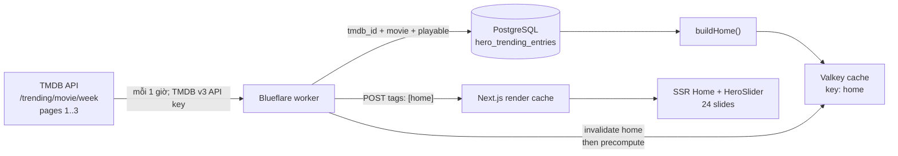

# Thiết kế lại HeroSlider: TMDB Trending phim lẻ theo tuần

**Trạng thái:** Kế hoạch triển khai — chưa thay đổi mã nguồn  
**Phạm vi:** HeroSlider ở trang `/`, Blueflare API/worker, PostgreSQL, Valkey và Next.js render cache  
**Mục tiêu làm mới:** Mỗi 60 phút tại backend; người dùng nhận snapshot mới qua cache invalidation, không gọi TMDB từ trình duyệt.

## 1. Mục tiêu và tiêu chí chấp nhận

Thay nguồn chọn hero hiện tại (tối đa 5 phim mới cập nhật) bằng **24 phim lẻ đang Trending theo tuần trên TMDB**, giữ nguyên thứ hạng TMDB, nhưng chỉ hiển thị phim đã có trong catalog Blueflare và có thể phát được.

Tiêu chí hoàn thành:

1. API gọi `GET /3/trending/movie/week` của TMDB, không dùng endpoint `all`, nên không lẫn TV show hoặc người. TMDB cho phép `week` là cửa sổ Trending. [TMDB Trending Movies](https://developer.themoviedb.org/reference/trending-movies)
2. Snapshot hero thành công có đúng 24 bản ghi **phim lẻ**, theo thứ tự TMDB, với `tmdb_id` duy nhất và mỗi phim có source phát, backdrop đã ký của Blueflare, và slug hợp lệ.
3. Worker lấy và đối chiếu snapshot tối thiểu mỗi giờ. Không làm mới dữ liệu chỉ vì người dùng mở trang hay để browser giữ API key.
4. Refresh thành công làm mất hiệu lực đúng cache `home` ở Valkey và Next.js; lượt render kế tiếp nhận danh sách mới. Không invalidation toàn bộ cache catalog.
5. Refresh thất bại hoặc không đủ 24 phim hợp lệ không xóa snapshot đang hoạt động; trang chủ vẫn phục vụ snapshot hợp lệ gần nhất.
6. HeroSlider nhận tối đa 24 item thay vì tự cắt xuống 6, vẫn tải eager/high-priority chỉ backdrop của slide đang active, vẫn tôn trọng `prefers-reduced-motion`.

## 2. Hiện trạng và khoảng cách cần xử lý

| Thành phần | Hiện tại | Cần thay đổi |
| --- | --- | --- |
| `backend/src/viewmodels.js` | `buildHome()` lấy 24 phim mới, lọc rồi lấy 5 làm `heroMovies`. | Đọc snapshot Trending đã được worker đối chiếu; không tự gọi TMDB trên đường request. |
| `backend/src/worker.js` | Đồng bộ catalog mỗi 15 phút; khi catalog đổi sẽ invalidate/precompute `home`. | Bổ sung job Trending độc lập theo hạn 1 giờ, lưu snapshot theo giao dịch rồi invalidate `home`. |
| PostgreSQL | `movies` có `tmdb_id`, `media_type`, trạng thái catalog và provider streams. | Thêm snapshot/ranking Hero bền vững; không sao chép metadata TMDB thành một catalog thứ hai. |
| `lib/catalog-server.ts` | Cache `getHomeServer()` theo tag `home`, stale/revalidate 300 giây. | Giữ tag `home`; nhận dữ liệu mới qua revalidate có mục tiêu. |
| `components/HeroSlider.tsx` | Lọc ảnh và `.slice(0, 6)`, các dots hiển thị từng item. | Chấp nhận 24 slide, thay dot list quá dài bằng chỉ báo vị trí/progress có nhãn. |

Hai nơi render home hiện hữu (`src/app/page.tsx` SSR và `components/HomeIsland.tsx` legacy client island) đều tiêu thụ `HomePayload.hero`; vì thế giữ nguyên shape `hero: MovieCard[]` để không phá contract public.

## 3. Quyết định kiến trúc



### Ranh giới trách nhiệm

- **TMDB:** chỉ xác định thứ hạng Trending Movie theo tuần và `tmdb_id`; không cung cấp ảnh hoặc URL phát cho frontend.
- **Worker:** là chủ sở hữu của refresh, validation, snapshot và invalidation. Đây là nơi duy nhất có secret TMDB.
- **PostgreSQL:** nguồn bền vững của snapshot hiện hành và thứ tự; xác minh catalog/playability bằng dữ liệu canonical hiện có.
- **API/view model:** ghép ranking snapshot với `movies`, serialise qua hàm `card()` để tiếp tục dùng `/i/m/` và `/i/d/` đã ký.
- **Next.js/UI:** render snapshot có sẵn, xoay slide trong browser. Không polling TMDB, không ký ảnh ở client và không tự tạo cache key ảnh.

## 4. Cấu hình và bảo mật

`TMDB_ID` không phải tên phù hợp cho credential vì `tmdb_id` là ID của từng phim. Kế hoạch dùng tên rõ nghĩa dưới đây; người vận hành điền token vào `backend/.env` khi triển khai.

```dotenv
# Backend only — không có tiền tố NEXT_PUBLIC_ và không commit giá trị thật.
TMDB_API_KEY=replace-with-tmdb-v3-api-key
TMDB_BASE_URL=https://api.themoviedb.org/3
TMDB_TRENDING_LANGUAGE=vi-VN
HERO_TRENDING_LIMIT=24
HERO_TRENDING_CANDIDATE_PAGES=3
HERO_TRENDING_REFRESH_MS=3600000
```

- Gửi v3 API key bằng query parameter `api_key` chỉ trong request backend đến TMDB; không log full URL để tránh lộ key. [TMDB API getting started](https://developer.themoviedb.org/reference/getting-started)
- `TMDB_BASE_URL` chỉ cho phép HTTPS, chuẩn hóa bỏ dấu `/` cuối; không log header, token hoặc body đầy đủ khi lỗi.
- API key/token không xuất hiện ở frontend `.env.example`, Compose `frontend.environment`, response API, log, metric label hoặc exception message.
- Nếu tổ chức chỉ có v3 API key, có thể thay adapter auth để dùng query `api_key`; đây là quyết định vận hành trước khi code, không hỗ trợ đồng thời hai credential trong phiên bản đầu.

## 5. Dữ liệu, migration và truy vấn chọn phim

### 5.1 Snapshot đề xuất

Thêm migration mới, ví dụ `006_hero_trending_snapshot.sql`:

```sql
CREATE TABLE hero_trending_entries (
  position smallint PRIMARY KEY CHECK (position BETWEEN 1 AND 24),
  movie_id uuid NOT NULL REFERENCES movies(id) ON DELETE CASCADE,
  tmdb_id bigint NOT NULL,
  fetched_at timestamptz NOT NULL,
  UNIQUE (movie_id),
  UNIQUE (tmdb_id)
);

CREATE INDEX hero_trending_entries_movie_idx
  ON hero_trending_entries (movie_id);

CREATE TABLE hero_trending_refresh_state (
  singleton boolean PRIMARY KEY DEFAULT true CHECK (singleton),
  last_success_at timestamptz,
  last_attempt_at timestamptz,
  last_error text,
  candidate_count integer,
  matched_count integer
);
```

`hero_trending_entries` là snapshot đang hoạt động duy nhất, không phải lịch sử. Bảng state phục vụ scheduler, health/metrics và chẩn đoán. Lưu `tmdb_id` cùng `movie_id` để phát hiện sai lệch identity khi catalog thay đổi.

### 5.2 Luật đối chiếu và điều kiện hợp lệ

Worker lấy tuần tự thứ hạng TMDB từ trang 1–3 (tối đa 60 ứng viên), khử trùng lặp `id`, sau đó query theo thứ tự với `unnest(... WITH ORDINALITY)`. Một ứng viên chỉ được đưa vào snapshot khi đồng thời:

1. `movies.tmdb_id` bằng TMDB `id`;
2. `movies.media_type = 'movie'` — đây là cùng tiêu chí `phim-le` hiện có trong `listCanonical()`;
3. `movies.catalog_state = 'ready'`;
4. có `poster_source_url` và `poster_asset_id` (hoặc fallback thumb hợp lệ qua `card()`);
5. có ít nhất một `movie_provider_sources` với `availability = true`, `streams` là array và không rỗng;
6. `canonical_slug` không rỗng.

Không làm fuzzy matching theo title/năm trong job này: catalog đã có luồng identity chuẩn theo TMDB ID + media family. Nếu thiếu `tmdb_id`, phim không đủ điều kiện cho Hero Trending cho đến khi dữ liệu provider được đồng bộ chính xác.

Repository thêm hai hàm có phạm vi hẹp:

- `resolveTrendingMovieCandidates(tmdbIds, limit)` — trả về canonical rows theo `ordinality` TMDB, chỉ với điều kiện trên.
- `replaceHeroTrendingSnapshot(entries, metadata)` — transaction: validate 24 vị trí 1..24 và ID duy nhất; delete/insert snapshot; cập nhật state; commit. Không xóa snapshot trước khi validation hoàn tất.

## 6. Luồng refresh mỗi giờ

1. Khi worker khởi động và sau đó khi `last_success_at + HERO_TRENDING_REFRESH_MS` đã đến hạn, gọi `refreshHeroTrendingIfDue()`; retry ở vòng worker kế tiếp nếu lần trước lỗi.
2. Dùng PostgreSQL advisory lock riêng cho job để an toàn nếu sau này chạy nhiều worker; một tiến trình không có lock thì bỏ qua.
3. Gọi `GET {TMDB_BASE_URL}/trending/movie/week?language=vi-VN&page=1..3`, timeout 5 giây mỗi request, giới hạn tổng request đúng ba page, và xác thực `results` là array của ID số.
4. Gọi repository để đối chiếu; giữ nguyên ranking TMDB và lấy 24 kết quả đầu tiên đạt điều kiện.
5. Nếu đủ 24, ghi snapshot và metadata trong một transaction. Sau commit mới được invalidate Valkey key `home`, gọi frontend revalidation với `tags: ['home']`, rồi `getOrBuild('home', buildHome, ...)` để precompute lại cache API.
6. Nếu lỗi mạng, 401/403, 429, schema bất thường, hoặc chỉ đối chiếu được dưới 24: cập nhật `last_attempt_at`/`last_error`, tăng metric lỗi, giữ snapshot cũ, **không invalidate** `home`.

Job này chạy trong process `worker` hiện có, không thêm cron container, Cloudflare Worker hay browser timer. Thời điểm thực tế được đo bằng `last_success_at`, không dựa vào `setInterval` bị trôi; mục tiêu vận hành là refresh mỗi 60 phút cộng tối đa một chu kỳ worker hiện hữu khi worker đang bận.

### Khởi tạo và fallback

- Sau migration, nếu chưa có snapshot, `buildHome()` dùng fallback hiện có: tối đa 24 canonical phim lẻ mới nhất có thể phát và có ảnh. Response có thể ít hơn 24 chỉ trong trạng thái bootstrap/degraded.
- Lần refresh TMDB đầu tiên chỉ thay fallback khi tìm đủ 24 entry. Do đó yêu cầu hiển thị đủ 24 không bị thay bằng một tập TMDB thiếu do catalog chưa sync.
- Khi snapshot cũ chứa phim bị xóa hoặc mất playback, `buildHome()` bỏ entry không còn hợp lệ. Worker sẽ thay snapshot ở lần chạy kế tiếp; monitoring báo `hero_snapshot_served_count < 24` để điều tra thay vì âm thầm lấp bằng phim không Trending.

## 7. Contract API và cache

Không tạo endpoint công khai mới ở giai đoạn một. `/api/home-data` vẫn trả:

```json
{
  "heroMovies": [
    { "slug": "...", "name": "...", "tmdb": { "id": 123, "type": "movie" }, "poster_url": "/i/d/..." }
  ],
  "newMovies": { "items": [] }
}
```

Thay đổi semantic: `heroMovies` là danh sách TMDB Trending Weekly đã đối chiếu, tối đa/chính xác 24 sau khi hệ thống healthy; các section còn lại không đổi.

Chuỗi cache sau một refresh thành công:

1. transaction snapshot commit;
2. worker xóa Valkey response key `home`;
3. worker gửi signed internal POST đến `/api/internal/revalidate` với tag `home`;
4. worker precompute `/api/home-data` mới;
5. request SSR tiếp theo đến `getHomeServer()` được Next.js tái tạo theo tag, và HeroSlider nhận snapshot mới.

Cloudflare có thể còn phục vụ response API ở edge trong TTL hiện hành ngắn; đó là độ trễ chấp nhận được, không phải một nguồn dữ liệu thứ hai. Không thay đổi cache policy của ảnh đã ký hay thêm cache key theo slide/route.

## 8. Thiết kế logic frontend

### Dữ liệu và trạng thái

- Sửa `slides` từ `.slice(0, 6)` thành `.slice(0, 24)`; vẫn loại item thiếu slug hoặc ảnh.
- Khi prop danh sách thay đổi, giữ active slide theo `slug` nếu còn tồn tại; nếu không, reset có chủ đích về vị trí 0. Không để `activeIndex` cũ trỏ sai sau một snapshot mới.
- Giữ auto-rotation 7 giây, pause khi `document.hidden`, restart sau thao tác manual, và tắt hoàn toàn khi reduced motion. Không cần client fetch theo giờ: backend snapshot/invalidation là nguồn sự thật.
- Chỉ mount backdrop active như hiện nay. Tuyệt đối không preload cả 24 ảnh, không thêm `srcset`, và chỉ slide đầu render eager/high priority.

### Điều khiển cho 24 slide

24 dots riêng lẻ không còn gọn hoặc dễ dùng. Thay bằng:

- desktop: Prev/Next và chỉ báo vị trí `01 / 24`, thay cho 24 dots quá dài;
- mobile: swipe vẫn có; thêm chỉ báo văn bản `01 / 24`, không hiển thị 24 control nhỏ;
- keyboard: Left/Right giữ nguyên; các nút Prev/Next có nhãn truy cập rõ ràng;
- a11y: `aria-roledescription="carousel"`, `aria-live="polite"` chỉ công bố slide khi thao tác manual, không spam screen reader theo auto-rotation.

Nút Phát/Thông tin giữ `hrefWithReturnTo()` và contract `returnTo` hiện hữu; không đưa hash fragment mới vào movie context.

## 9. Khả năng quan sát và vận hành

Thêm log JSON/structured fields không nhạy cảm:

- `hero_trending_refresh_success` với `duration_ms`, `candidate_count`, `matched_count=24`, `snapshot_age_seconds`;
- `hero_trending_refresh_failure` với lớp lỗi (`auth`, `rate_limit`, `upstream`, `schema`, `insufficient_catalog`), HTTP status nếu có, không có token/body;
- `hero_trending_snapshot_served_count` khi `buildHome()` trả dưới 24;
- `hero_trending_last_success_age_seconds` vào health/metrics nội bộ hiện có.

Cảnh báo khi `last_success_at` quá 2 giờ, matched count dưới 24 trong hai attempt liên tiếp, hoặc lỗi auth xuất hiện một lần. Runbook: xác nhận token `.env`, xem log worker, kiểm tra số movie canonical `ready` có `tmdb_id` và stream, rồi chạy refresh có kiểm soát; không xóa snapshot thủ công để “sửa” upstream outage.

## 10. Kế hoạch triển khai theo bước

1. **Chuẩn bị config:** thêm biến backend vào `backend/.env.example` và `config.js`; không đưa secret vào frontend/Compose public. Xác nhận loại credential TMDB trước khi release.
2. **Persistence:** thêm migration snapshot/state và repository query/transaction; thêm index nếu `EXPLAIN` cho thấy join theo `tmdb_id` + `media_type` chưa dùng index hiện có.
3. **TMDB client:** tạo module backend nhỏ, injectable fetch, timeout, response validation và redacted errors. Không dùng TMDB image metadata.
4. **Scheduler:** tích hợp due check, advisory lock, refresh/fallback behavior vào `worker.js`; nối đúng invalidation `home` sau commit.
5. **View model/API:** `buildHome()` lấy snapshot, serialise bằng `card()`, fallback bootstrap 24 phim lẻ hợp lệ. Giữ các section và shape response.
6. **Hero component:** nhận 24 slide, bảo toàn active slug, thay pagination controls, kiểm tra keyboard/touch/reduced motion và ảnh priority.
7. **Kiểm thử & rollout:** chạy migration trong environment staging, điền token, theo dõi một chu kỳ refresh; sau đó mới build/release frontend/backend theo quy trình hiện hữu. Không restart VPS/Caddy hay deploy trong phạm vi kế hoạch này.

## 11. Ma trận kiểm thử và xác minh

| Lớp | Case bắt buộc | Kết quả mong đợi |
| --- | --- | --- |
| TMDB client | 200 hợp lệ, timeout, 401, 429, `results` sai shape | Lỗi được phân loại, secret không xuất hiện, không ghi snapshot lỗi. |
| Repository | ID TMDB trùng, TV show, chưa ready, thiếu stream/ảnh, ordering | Chỉ movie playable được trả, thứ tự TMDB không thay đổi, tối đa 24. |
| Snapshot transaction | 24 hợp lệ; 23 hợp lệ; transaction lỗi giữa chừng | 24 thay toàn bộ atomically; dưới 24/rollback giữ snapshot cũ. |
| Worker | đến hạn, chưa đến hạn, lock bị giữ, refresh thành công/thất bại | Chỉ một refresh; success invalidates `home`; failure không invalidate. |
| View model/API | snapshot 24; bootstrap; entry snapshot mất playback | `/api/home-data` giữ contract; trả 24 khi healthy; degraded được metric. |
| HeroSlider | 24 items, đổi props, swipe, key, reduced motion, tab hidden | Không out-of-bounds; đúng slide/URL; không auto move khi reduced motion/hidden. |
| Build | `npm test` tại `backend`, `npm run build` tại root | Cả hai pass trước release. |

Kiểm tra production sau release (cần quyền deploy riêng): xem `last_success_at`, gọi nội bộ `/api/home-data` xác nhận `heroMovies.length === 24`, xác minh thứ tự `tmdb.id` đúng snapshot, mở `/` ở desktop/mobile, và theo dõi log worker tối thiểu hai chu kỳ.

## 12. Rủi ro và quyết định mở

- **Catalog không có đủ phim TMDB Trending:** Đây là khả năng bình thường; cơ chế giữ last-known-good tránh làm trang chủ co xuống. Cần quyết định sau rollout liệu có mở rộng sync catalog theo TMDB hay chấp nhận tỷ lệ match thấp; không đưa fallback title-search mơ hồ vào phiên bản đầu.
- **Khái niệm “làm mới mỗi giờ”:** Thiết kế này refresh server snapshot mỗi giờ. Một tab đang mở không tự đổi hero giữa phiên để tránh giật nội dung và tải thêm; tab sẽ nhận snapshot mới khi navigation/refresh. Nếu muốn đổi live trong tab, cần một yêu cầu sản phẩm riêng cho polling/SSE và UX thông báo.
- **Ngôn ngữ TMDB:** `vi-VN` chỉ ảnh hưởng localized metadata trả về bởi TMDB, còn UI luôn dùng metadata canonical provider. Có thể đổi biến nếu cần thứ tự/localization khác.
- **Attribution:** Trang Settings hiện đã có TMDB attribution. Cần rà lại điều khoản sử dụng/branding TMDB trước release vì dữ liệu Trending giờ là nguồn trực tiếp của Hero.

